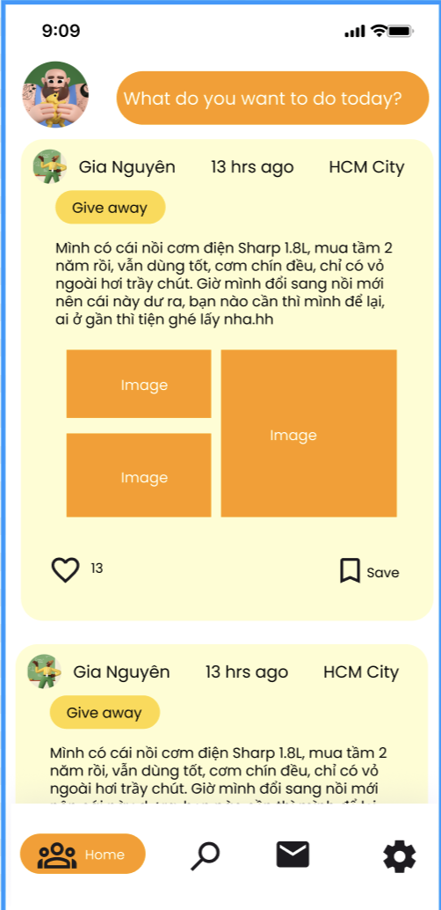
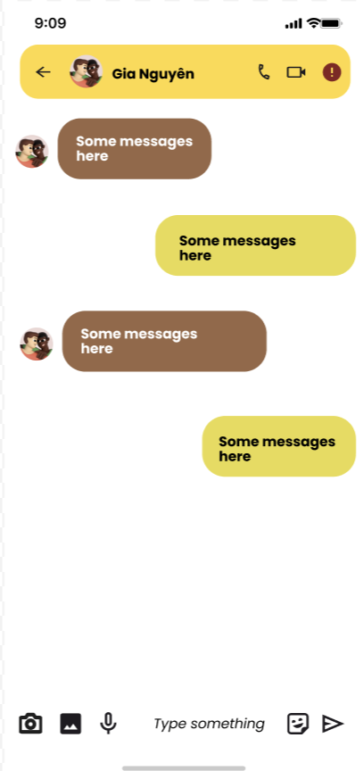

<!DOCTYPE html>
<html lang="en-US">
  <head>
    <title>Share In</title>

    <meta charset="UTF-8">
    <meta http-equiv="X-UA-Compatible" content="IE=edge">
    <meta name="viewport" content="width=device-width, initial-scale=1">
    <meta name="description" content="The Minimal Light is a simple and elegant jekyll theme for academic personal homepage.">
    
    <meta name="keywords" content="minimal light">
    
    
    <link rel="canonical" href="https://minimal-light-theme.yliu.me/"/>
    

    <link rel="icon" media="(prefers-color-scheme:dark)" href="./html_source_file/assets/img/favicon-dark.png" type="image/png" />
    <link rel="icon" media="(prefers-color-scheme:light)" href="./html_source_file/assets/img/favicon.png" type="image/png" />
    

    <link rel=stylesheet href=https://cdnjs.cloudflare.com/ajax/libs/academicons/1.8.6/css/academicons.min.css integrity="sha256-uFVgMKfistnJAfoCUQigIl+JfUaP47GrRKjf6CTPVmw=" crossorigin=anonymous>
    <link rel=stylesheet href=https://cdnjs.cloudflare.com/ajax/libs/font-awesome/5.11.2/css/all.min.css integrity="sha256-+N4/V/SbAFiW1MPBCXnfnP9QSN3+Keu+NlB+0ev/YKQ=" crossorigin=anonymous>
    
    <link rel="stylesheet" href="./html_source_file/assets/css/style.css">
    <link rel="stylesheet" href="./html_source_file/assets/css/publications.css">

    
    

  </head>
  <body>
    

      <header>
        
        
        

        <h1>Nhóm L01 - Mobile app</h1>

        <table>
            <caption>Danh sách thành viên nhóm</caption>
            <thead>
              <tr>
                <th>Họ và Tên</th>
                <th>MSSV</th>
              </tr>
            </thead>
            <tbody>
              <tr>
                <td>Trần Minh Quân</td>
                <td>2212822</td>
              </tr>
              <tr>
                <td>Hoàng Nhật Linh</td>
                <td>2211847</td>
              </tr>
              <tr>
                <td>Phạm Gia Nguyên</td>
                <td>2212319</td>
              </tr>
              <tr>
                <td>Nguyễn Hà Thùy Linh</td>
                <td>2211856</td>
              </tr>
            </tbody>
          </table>       

         
         

      </header>
      <section>

      

        <h1>Đổi Đồ Mobile Application - Project Plan</h1>
        
Ứng dụng trao đổi, tặng, bán đồ cũ cho sinh viên trong ký túc xá

        

          <h2>App Preview</h2>
          

            
            
            
          

        

        <h2>Project Overview</h2>
        
<strong>Đổi Đồ</strong> là ứng dụng giúp sinh viên trong cùng trường hoặc ký túc xá dễ dàng <strong>trao đổi, tặng, hoặc bán đồ cũ</strong> như sách, bàn ghế, thiết bị điện tử... thay vì bỏ đi. Ứng dụng đơn giản, thân thiện và không yêu cầu quy trình thương mại phức tạp.

        <h2>Pain Points</h2>
        <ul>
          <li>Đồ dùng cũ thường bị lãng phí do không có nơi trao đổi.</li>
          <li>Việc đăng bán trên các nền tảng chung quá phức tạp.</li>
          <li>Thiếu môi trường riêng cho sinh viên trong cùng khu vực.</li>
        </ul>

        <h2>Target Audience</h2>
        <ul>
          <li>Sinh viên cùng trường hoặc cùng ký túc xá.</li>
          <li>Thời điểm cao điểm: đầu/cuối học kỳ, chuyển phòng.</li>
        </ul>

        <h2>Core Features</h2>
        <ul>
          <li>Đăng bài nhanh: ảnh, tên món đồ, danh mục, trạng thái (tặng / trao đổi / bán).</li>
          <li>Tìm kiếm và duyệt theo danh mục (sách, đồ điện tử, đồ cá nhân,...).</li>
          <li>Chat trực tiếp để thương lượng và hẹn giao nhận trong khuôn viên.</li>
        </ul>

        

          <h3>Technology Stack</h3>
          <ul>
            <li><strong>Frontend:</strong> React Native (Android/iOS)</li>
            <li><strong>Backend:</strong> Node.js + MongoDB</li>
            <li><strong>Real-time:</strong> Firebase (chat, notifications)</li>
            <li><strong>Auth:</strong> JWT / Firebase Auth</li>
          </ul>
        

      
      

      </section>

    

    
    
    
    
  </body>
</html>

